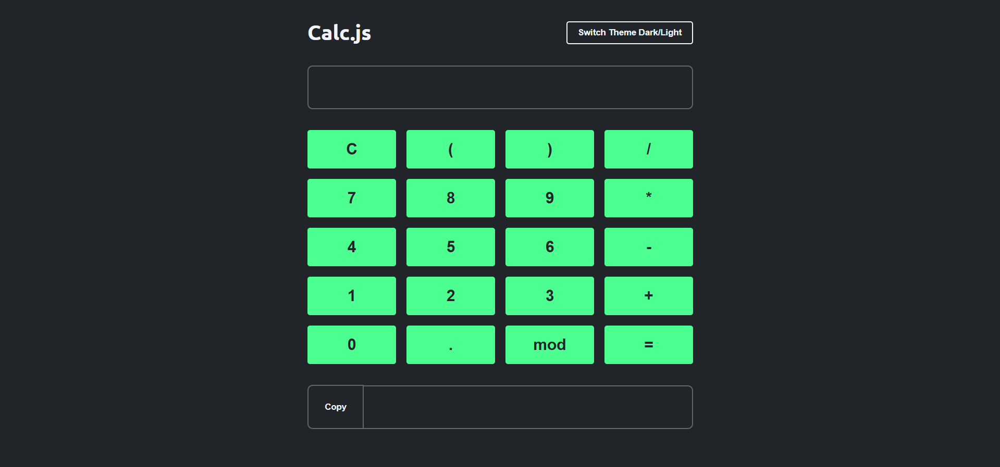

# 🧮 Calc JS

📜 **Descrição**  
Este é um projeto de uma calculadora feita com JavaScript, desenvolvida como parte dos projetos práticos do curso de formação em JavaScript. O objetivo deste projeto é praticar e aplicar conceitos de manipulação do DOM, eventos e lógica de programação, criando uma aplicação funcional e interativa para realizar operações matemáticas básicas.

## 🚀 Tecnologias Utilizadas

- **HTML5** → Estrutura básica fornecida pelo curso, usada para organizar os elementos da calculadora.
- **CSS3** → Estilos prontos aplicados para definir o layout e visual da calculadora.
- **JavaScript** → Desenvolvido do zero para implementar toda a lógica, eventos e funcionalidades da calculadora.

## 🖼️ Demonstração



## 🔗 Link para o Deploy

Você pode ver a versão final do projeto em [Aqui](https://calc-js-iota.vercel.app/).

## 🔧 Como Executar o Projeto

1. **Clone o repositório:**

   ```bash
   git clone https://github.com/KevinTereza/calc-js.git
   ```

2. **Acesse o diretório do projeto:**

    ```bash
    cd calc-js
    ```

3. **Abra o arquivo index.html no seu navegador para visualizar o projeto.**

## 📄 Licença

Este é um projeto de estudo, criado com fins de aprendizado e sem fins comerciais.


